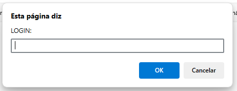
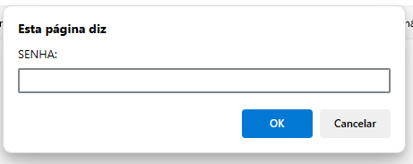
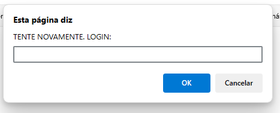
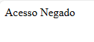
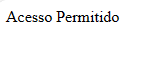

# javascript-LoginPrompt
uma das primeiras aulas de javascript. um login com o prompt do javascript para web. 
também tem uns códigos para tabuada e aparecer o nome várias vezes na tela.
  

  <h3>O alert pergunta o usuário e a senha</h3>
  

  

  <h3>Se errar, tem mais umas tentativas</h3>
  

  

  <h3>No final, ou é um ou é outro</h3>
  

